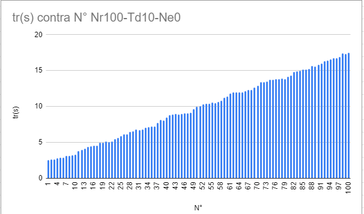

Testing was done with the insidesound backend connected to rds. He himself has two strategies for request control.
 The most used Controller-Service-Dao and a buffered Queue implementation

 Two test scenarios were created, number of threads, time between requests and response and processing times were measured. and the https status

scenario one: request without queue 

Nr = Number of requests
Td = Time between requests
Ne= Number of errors

[]
