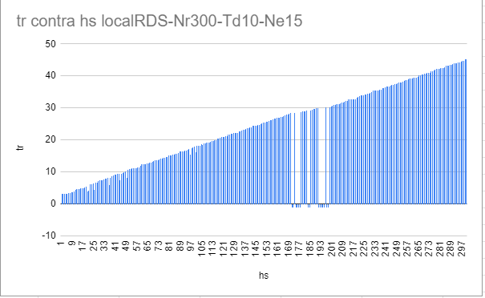

Multi-threaded app that generates alternating input of two URLs, controlling the waiting time between each one, and calculating the response time of each request

Testing was done with the insidesound backend connected to rds. He himself has two strategies for request control.
 The most used Controller-Service-Dao and a buffered Queue implementation

 

 Two test scenarios were created, number of threads, time between requests and response and processing times were measured. and the https status

scenario one: request without queue (local-rds.py)

 

Nr = Number of requests
Td = Time between requests
Ne= Number of errors

scenario two: request with queue (local-queue-rds.py)

Conclusion: It is observed that with 300 requests without a queue there are errors, these disappear with the implementation of the buffered queue

About the implementation in the backend inside
Request Queue: You have created a queue (requestIdQueue) to store incoming MP3 requests. When a request arrives, it is queued into this data structure.
Buffer: You also have a buffer that acts as an intermediate area between the request queue and the actual processing. This allows you to move requests from the queue to a buffer before processing them, which can help control flow and concurrency.
Semaphore: You use a semaphore to limit the maximum number of requests that can be processed simultaneously. This ensures that the system is not overloaded with too many requests at the same time. By initializing the semaphore with a limit of 100, you are restricting the maximum number of concurrent requests to 100.
Asynchronous Processing: You use CompletableFuture.runAsync() to process requests asynchronously in a separate thread. This allows the main thread to not block while waiting for I/O operations to complete.
Response and Return of Results: Once a request is processed, you generate a response that includes the result of the processing (for example, the MP3 or an error code) and any additional information, such as the processing time. This response is added to a response queue (responseQueue) to be delivered to the corresponding client or consumer.

repositorio backend: https://github.com/theinsideshine/springcloud-insidesound/tree/monolithic_backend